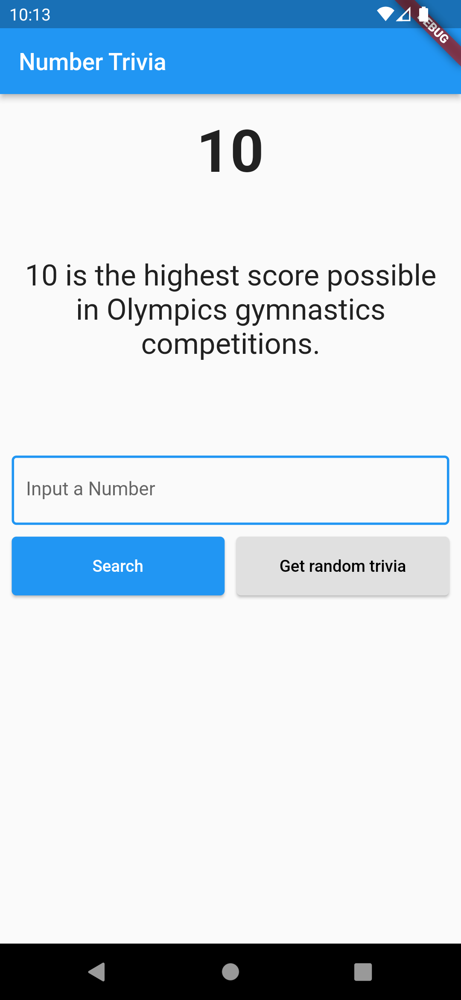
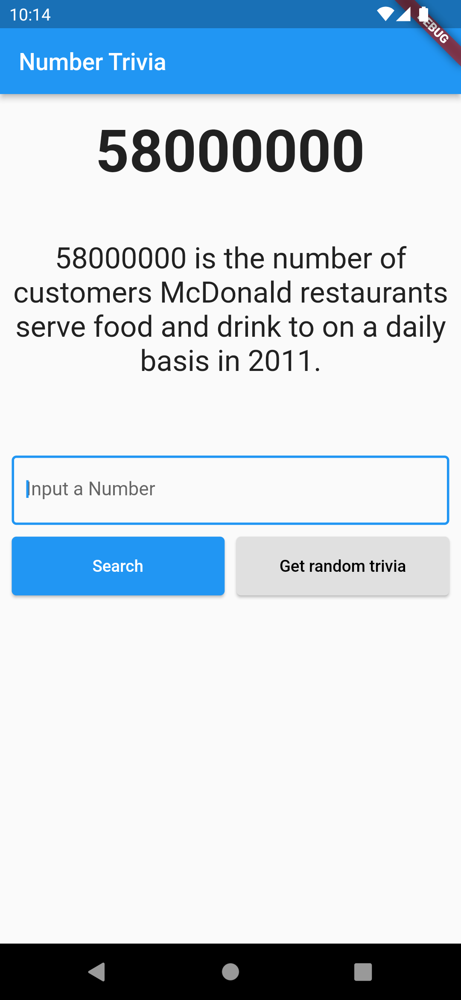
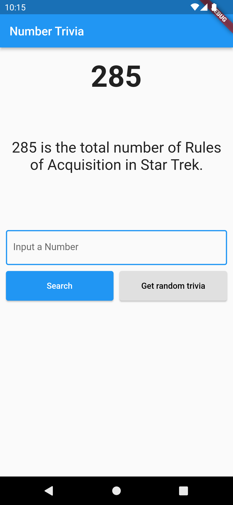

<h1 align="center">Number Trivia</h1>
<p align="center">
  
  
  
  
</p>


# :iphone: Sobre o Projeto

<p>
  Este Aplicativo permite a visualização de curiosidades sobre os números (number trivia)
  
  A partir do desenvolvimento do App foi possível treinar a utilização de Clear Architecture e TDD
  
  A arquitetura segue o padrão de divisão de camadas em Data, Domain e Presentation
  
  O projeto foi baseado na playlist de vídeos do [ResoCoder](https://www.youtube.com/watch?v=KjE2IDphA_U&list=PLB6lc7nQ1n4iYGE_khpXRdJkJEp9WOech&ab_channel=ResoCoder)
</p>

# :camera: Screenshots
<div align="center">
   
   
   
</div>


# :rocket: Tecnologias

- [Flutter](https://flutter.dev/)
- [Dart](https://pub.dev/)
- [Flutter bloc](https://pub.dev/packages/flutter_bloc)
- [Bloc](https://pub.dev/packages/bloc)
- [Github](https://github.com)


# :computer: Como rodar

```bash
# Clone Repositorio
$ git clone https://github.com/WallaceHolanda/number_trivia.git

# Instale as dependências
$ flutter pub get

# Rode a aplicação
$ flutter run
```


# :page_facing_up: Licença

Este projeto está sob a [MIT License](./LICENSE)

Feito por Wallace Holanda
